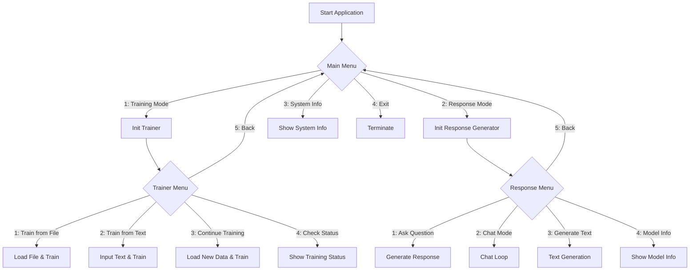

# Custom LLM System

This project is a **fully self-contained Large Language Model** (LLM) trainer and inference system built in PyTorch.  
It allows you to:

- Train your own transformer-based language model on custom text data.
- Use either **BPE** or **SentencePiece** tokenization.
- Continuously improve and extend the model.
- Generate responses or text from prompts.
- Interact with the model via a friendly console menu.

---

## 🚀 Features

✅ Transformer-based architecture with configurable depth and width  
✅ BPE and SentencePiece tokenizers  
✅ Continuous training and vocabulary expansion  
✅ Mixed precision training (if GPU supports)  
✅ Interactive menus for training and response generation

---

## 🛠️ Project Structure

---

## 📈 System Flow

Below is a **Mermaid diagram** explaining the main process:

