# Custom LLM System

A comprehensive, production-ready Large Language Model training and inference platform built with PyTorch. This system provides end-to-end capabilities for training transformer-based language models from scratch, with support for multiple tokenization strategies and continuous learning workflows.

## 🎯 Overview

The Custom LLM System is designed for researchers, developers, and organizations who need to train domain-specific language models on their own datasets. It offers a complete pipeline from data preprocessing to model deployment, with an intuitive interface and robust training capabilities.

### Key Capabilities

- **🏗️ Complete Training Pipeline**: Train transformer models from scratch on custom datasets
- **🔧 Flexible Architecture**: Configurable model parameters based on available hardware
- **📚 Dual Tokenization**: Support for both BPE and SentencePiece tokenizers
- **🔄 Continuous Learning**: Expand vocabulary and continue training with new data
- **⚡ GPU Optimization**: Mixed precision training with automatic memory management
- **💬 Interactive Interface**: User-friendly console-based interaction system
- **📊 Real-time Monitoring**: Training progress tracking with loss visualization
- **💾 Robust Persistence**: Automatic checkpointing and model state management

## 🏛️ Architecture

### System Components

The system is built with a modular architecture comprising four core components:

- **`interface.py`**: Main application interface with menu-driven interaction
- **`model.py`**: Transformer architecture implementation and tokenizer classes
- **`trainer.py`**: Training engine with continuous learning capabilities
- **`response_generator.py`**: Text generation and inference pipeline

### Model Architecture Details

- **Transformer Architecture**: Multi-head attention with causal masking
- **Positional Encoding**: Learned positional embeddings
- **Layer Normalization**: Pre-norm configuration for stable training
- **Feed-Forward Networks**: GELU activation with configurable dimensions
- **Adaptive Configuration**: Hardware-based parameter scaling

## 📊 System Workflow

The following diagram illustrates the complete system workflow and component interactions:

```mermaid
flowchart TD
    Start([🚀 Application Start]) --> Init{Initialize System}
    Init --> TokenChoice[Select Tokenizer Type<br/>BPE or SentencePiece]
    TokenChoice --> MainMenu{📋 Main Menu}
    
    %% Main Menu Options
    MainMenu --> |1| TrainingMode[🎓 Training Mode]
    MainMenu --> |2| ResponseMode[🤖 Response Mode]
    MainMenu --> |3| SystemInfo[📊 System Information]
    MainMenu --> |4| Exit([👋 Exit Application])
    
    %% Training Mode Flow
    TrainingMode --> TrainInit{Initialize Trainer}
    TrainInit --> ModelExists{Model Exists?}
    ModelExists --> |Yes| LoadModel[📂 Load Existing Model<br/>Resume from checkpoint]
    ModelExists --> |No| CreateNew[🔧 Create New Model<br/>Initialize architecture]
    
    LoadModel --> TrainMenu{🎓 Training Menu}
    CreateNew --> TrainMenu
    
    TrainMenu --> |1| FileTraining[📄 Train from File]
    TrainMenu --> |2| TextTraining[✏️ Train from Input]
    TrainMenu --> |3| ContinueTraining[🔄 Continue Training]
    TrainMenu --> |4| TrainStatus[📈 Training Status]
    TrainMenu --> |5| BackToMain[⬅️ Back to Main]
    
    %% File Training Process
    FileTraining --> LoadFile[📁 Load Data File]
    LoadFile --> ChunkData[🔪 Chunk Text Data<br/>512 char segments]
    ChunkData --> PrepareTokens[🎯 Tokenize Data<br/>Create training batches]
    PrepareTokens --> TrainLoop[🏃‍♂️ Training Loop<br/>Forward/Backward pass]
    
    %% Text Input Training
    TextTraining --> InputText[⌨️ Input Text Data]
    InputText --> ProcessInput[🔄 Process Input<br/>Split into chunks]
    ProcessInput --> PrepareTokens
    
    %% Continue Training
    ContinueTraining --> LoadNewData[📥 Load New Data]
    LoadNewData --> ExpandVocab{Expand Vocabulary?}
    ExpandVocab --> |Yes| UpdateTokenizer[🔤 Update Tokenizer<br/>Add new tokens]
    ExpandVocab --> |No| UseExisting[✅ Use Existing Vocab]
    UpdateTokenizer --> ExpandModel[🔧 Expand Model<br/>Resize embeddings]
    UseExisting --> PrepareTokens
    ExpandModel --> PrepareTokens
    
    %% Training Loop Details
    TrainLoop --> Batch[📦 Process Batch<br/>GPU transfer]
    Batch --> Forward[⚡ Forward Pass<br/>Mixed precision]
    Forward --> Loss[📉 Calculate Loss<br/>Cross entropy]
    Loss --> Backward[⬅️ Backward Pass<br/>Gradient computation]
    Backward --> Update[🔄 Update Weights<br/>AdamW optimizer]
    Update --> Schedule[📅 Learning Rate Schedule<br/>Cosine annealing]
    Schedule --> Checkpoint{Save Checkpoint?}
    Checkpoint --> |Every 100 steps| SaveModel[💾 Save Model State<br/>Weights + optimizer]
    Checkpoint --> |Continue| BatchDone{More Batches?}
    SaveModel --> BatchDone
    BatchDone --> |Yes| Batch
    BatchDone --> |No| EpochDone{More Epochs?}
    EpochDone --> |Yes| TrainLoop
    EpochDone --> |No| TrainComplete[✅ Training Complete]
    
    %% Response Mode Flow
    ResponseMode --> RespInit{Initialize Generator}
    RespInit --> ModelCheck{Trained Model Exists?}
    ModelCheck --> |No| NoModel[❌ No Model Found<br/>Train first]
    ModelCheck --> |Yes| LoadInference[📂 Load Model<br/>Set to eval mode]
    LoadInference --> RespMenu{🤖 Response Menu}
    
    RespMenu --> |1| QandA[❓ Q&A Mode<br/>Single question]
    RespMenu --> |2| ChatMode[💬 Chat Mode<br/>Continuous conversation]
    RespMenu --> |3| TextGen[📝 Text Generation<br/>From prompt]
    RespMenu --> |4| ModelInfo[ℹ️ Model Information]
    RespMenu --> |5| BackMain[⬅️ Back to Main]
    
    %% Inference Process
    QandA --> InputQuestion[❓ Input Question]
    ChatMode --> ChatLoop[💬 Continuous Chat<br/>Context maintained]
    TextGen --> InputPrompt[📝 Input Prompt]
    
    InputQuestion --> TokenizeInput[🎯 Tokenize Input<br/>Encode to IDs]
    ChatLoop --> TokenizeInput
    InputPrompt --> TokenizeInput
    
    TokenizeInput --> GenerateLoop[🔄 Generation Loop<br/>Autoregressive]
    GenerateLoop --> PredictNext[🎯 Predict Next Token<br/>Softmax over vocab]
    PredictNext --> SampleToken[🎲 Sample Token<br/>Temperature/top-k]
    SampleToken --> AppendToken[➕ Append to Sequence]
    AppendToken --> CheckStop{Stop Condition?}
    CheckStop --> |No| GenerateLoop
    CheckStop --> |Yes| DecodeOutput[🔤 Decode Output<br/>Tokens to text]
    DecodeOutput --> DisplayResult[📺 Display Result]
    
    %% System Information
    SystemInfo --> ShowHardware[🖥️ Hardware Info<br/>GPU/CPU details]
    ShowHardware --> ShowModel[🧠 Model Info<br/>Parameters/vocab]
    ShowModel --> ShowPaths[📁 File Paths<br/>Model directory]
    
    %% Return paths
    TrainComplete --> TrainMenu
    TrainStatus --> TrainMenu
    BackToMain --> MainMenu
    NoModel --> MainMenu
    DisplayResult --> RespMenu
    ModelInfo --> RespMenu
    BackMain --> MainMenu
    ShowPaths --> MainMenu
    
    %% Elegant Color Styling
    classDef startEnd fill:#f8f9ff,stroke:#6366f1,stroke-width:2px,color:#1e1b4b
    classDef process fill:#fef3f2,stroke:#f97316,stroke-width:2px,color:#9a3412
    classDef decision fill:#fefce8,stroke:#eab308,stroke-width:2px,color:#713f12
    classDef training fill:#f0fdf4,stroke:#22c55e,stroke-width:2px,color:#14532d
    classDef inference fill:#fdf2f8,stroke:#ec4899,stroke-width:2px,color:#831843
    classDef system fill:#f0f9ff,stroke:#0ea5e9,stroke-width:2px,color:#0c4a6e
    classDef menu fill:#fafafa,stroke:#6b7280,stroke-width:2px,color:#374151
    classDef data fill:#f5f3ff,stroke:#8b5cf6,stroke-width:2px,color:#581c87
    
    class Start,Exit startEnd
    class TrainLoop,GenerateLoop,Batch,Forward,Loss,Backward,Update,Schedule process
    class MainMenu,TrainMenu,RespMenu,ModelExists,ExpandVocab,Checkpoint,BatchDone,EpochDone,ModelCheck,CheckStop decision
    class FileTraining,TextTraining,ContinueTraining,TrainComplete,TrainStatus,UpdateTokenizer,ExpandModel training
    class QandA,ChatMode,TextGen,PredictNext,SampleToken,AppendToken,DecodeOutput,DisplayResult inference
    class SystemInfo,ShowHardware,ShowModel,ShowPaths system
    class Init,TrainInit,RespInit menu
    class LoadFile,ChunkData,PrepareTokens,LoadNewData,TokenizeInput,InputQuestion,ChatLoop,InputPrompt,LoadModel,CreateNew,LoadInference data
```



### Workflow Explanation

**🎯 Initialization Phase**
- System starts and initializes hardware detection
- User selects tokenizer type (BPE or SentencePiece)
- Main menu presents training, inference, and system options

**🎓 Training Workflow**
1. **Model Initialization**: Creates new model or loads existing checkpoint
2. **Data Processing**: Loads text files and chunks into training segments
3. **Tokenization**: Converts text to token IDs using selected tokenizer
4. **Training Loop**: Executes forward/backward passes with mixed precision
5. **Checkpointing**: Automatically saves model state every 100 steps
6. **Vocabulary Expansion**: Dynamically grows vocabulary with new data

**🤖 Inference Workflow**
1. **Model Loading**: Loads trained model in evaluation mode
2. **Input Processing**: Tokenizes user input questions or prompts
3. **Generation**: Autoregressively generates tokens using transformer
4. **Decoding**: Converts generated tokens back to human-readable text
5. **Output**: Displays results with context preservation in chat mode

## 🚀 Quick Start

### Prerequisites

```bash
# Python 3.8+ required
pip install torch>=1.12.0
pip install sentencepiece>=0.1.96
pip install tqdm>=4.64.0
```

### Installation

```bash
# Clone or download the project files
git clone <repository-url>
cd custom-llm-system

# Run the application
python interface.py
```

### First Training Session

1. **Start the application**:
   ```bash
   python interface.py
   ```

2. **Select tokenizer** (BPE recommended for beginners):
   ```
   Choose tokenizer (bpe/sentencepiece) [default: bpe]: bpe
   ```

3. **Navigate to Training Mode**:
   ```
   Main Menu: 1 (Training Mode)
   Training Menu: 1 (Train from File)
   ```

4. **Provide training data**:
   ```
   Enter file path: data/my_dataset.txt
   Enter number of epochs: 10
   ```

5. **Monitor training progress** with real-time loss updates

### First Inference Session

1. **Navigate to Response Mode**:
   ```
   Main Menu: 2 (Response Mode)
   Response Menu: 2 (Chat Mode)
   ```

2. **Start conversing**:
   ```
   You: What is machine learning?
   AI: [Generated response based on training data]
   ```

## 🔧 Configuration

### Hardware-Based Model Scaling

The system automatically configures model parameters based on available GPU memory:

| GPU Memory | Model Config | Parameters |
|------------|--------------|------------|
| 24GB+ | Large (d_model=1024, layers=12) | ~100M+ |
| 12GB+ | Medium (d_model=768, layers=8) | ~50M+ |
| 8GB+ | Standard (d_model=512, layers=6) | ~25M+ |
| <8GB | Compact (d_model=256, layers=4) | ~10M+ |

### Training Parameters

```python
# Configurable training settings
LEARNING_RATE = 3e-4          # AdamW learning rate
BATCH_SIZE = auto             # Auto-scaled by GPU memory
MAX_SEQ_LEN = 256            # Maximum sequence length
DROPOUT = 0.1                # Dropout probability
WEIGHT_DECAY = 0.01          # L2 regularization
GRAD_CLIP = 1.0              # Gradient clipping norm
```

## 📁 Project Structure

```
custom-llm-system/
├── interface.py              # 🖥️  Main application interface
├── model.py                  # 🧠  Model architecture & tokenizers
├── trainer.py                # 🎓  Training engine
├── response_generator.py     # 🤖  Text generation pipeline
├── custom_llm/              # 📁  Model storage directory
│   ├── config.json          # ⚙️   Model configuration
│   ├── model.pth            # 🧠  Model weights
│   ├── tokenizer.json       # 🔤  Tokenizer vocabulary
│   ├── checkpoint.pth       # 💾  Training checkpoint
│   └── tokenizer_type.txt   # 📝  Tokenizer type info
└── README.md                # 📖  This documentation
```

## 🎛️ Advanced Features

### Continuous Learning

The system supports incremental learning with vocabulary expansion:

```python
# Add new domain-specific data
trainer.train_on_new_data(new_texts, epochs=5)

# Automatically expands vocabulary and model embeddings
# Preserves existing knowledge while learning new concepts
```

### Mixed Precision Training

Automatic mixed precision training for supported GPUs:

- **Memory Efficiency**: Reduces memory usage by ~50%
- **Speed Improvement**: 1.5-2x training speedup
- **Gradient Scaling**: Prevents underflow in float16 operations

### Tokenizer Comparison

| Feature | BPE | SentencePiece |
|---------|-----|---------------|
| **Speed** | Fast | Moderate |
| **Memory** | Low | Higher |
| **Subword Quality** | Good | Excellent |
| **Language Support** | Basic | Multi-lingual |
| **Recommended For** | English, Simple | Complex, Multi-lang |

## 📊 Performance Monitoring

### Training Metrics

The system provides real-time training feedback:

```
Epoch 5/10: 100%|██████████| 150/150 [02:34<00:00, 0.97it/s]
loss: 2.1847, lr: 2.85e-04, step: 750
```

### Model Information

Access detailed model statistics:

```
Model Information:
- Parameters: 25,165,824
- Vocabulary Size: 10,000
- Architecture: 6 layers, 8 heads
- Memory Usage: 96MB
- Training Steps: 1,500
```

## 🔍 Troubleshooting

### Common Issues

**Out of Memory Errors**
```bash
# Reduce batch size or model dimensions
# System auto-scales, but manual adjustment may be needed
```

**Slow Training**
```bash
# Enable mixed precision (automatic on supported GPUs)
# Reduce sequence length for faster iterations
```

**Poor Generation Quality**
```bash
# Increase training data size (10K+ sentences recommended)
# Train for more epochs (20+ for complex tasks)
# Use SentencePiece for better subword tokenization
```

## 🤝 Contributing

We welcome contributions! Areas for improvement:

- **New Architectures**: GPT-4 style improvements, MoE models
- **Training Optimizations**: Better learning rate schedules, regularization
- **Interface Enhancements**: Web UI, API endpoints
- **Tokenizer Extensions**: Custom tokenization strategies
- **Evaluation Metrics**: Perplexity, BLEU scores, human evaluation

## 📄 License

This project is licensed under the MIT License - see the [LICENSE](LICENSE) file for details.

## 🙏 Acknowledgments

- **PyTorch Team**: For the excellent deep learning framework
- **SentencePiece**: For robust tokenization capabilities
- **Transformer Architecture**: Based on "Attention Is All You Need"
- **Open Source Community**: For inspiration and best practices

## 📞 Support

For questions, issues, or contributions:

- **Issues**: Open a GitHub issue for bugs or feature requests
- **Discussions**: Use GitHub Discussions for questions and ideas
- **Documentation**: Check this README and inline code comments

---

**Built with ❤️ for the open source community**
